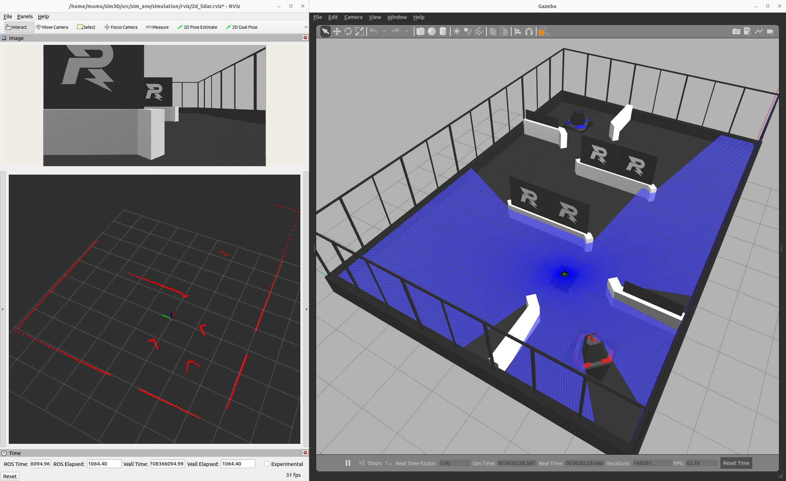
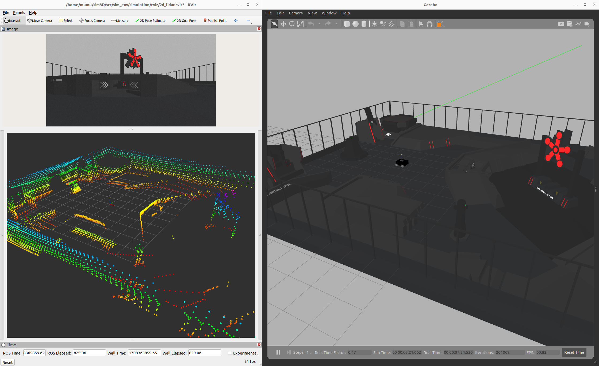
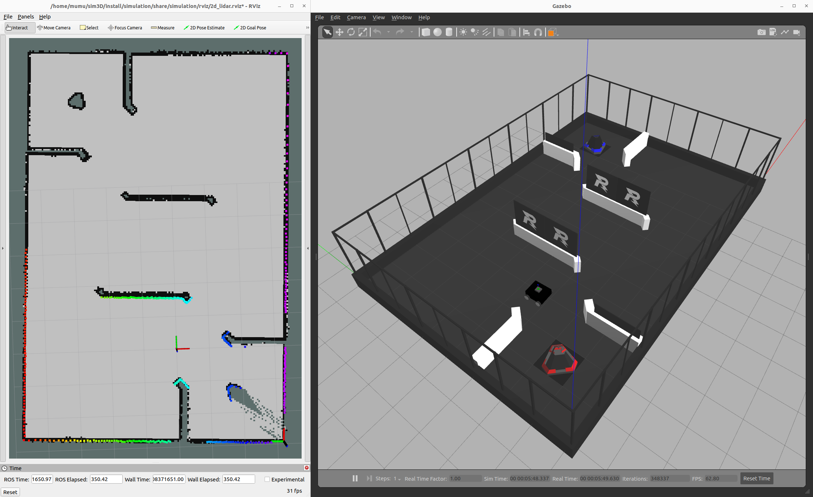

# RMSIM_Gazebo_24

## 1. Introduction

Gazebo simulator for the RoboMaster 2024.

RMUL:



RMUC:



## 2. Prerequisites

### 2.1. Ubuntu & ROS

I tested my simulator on Ubuntu 22.04 with ROS Humble.    
Additional ROS package is required: 

```bash
sudo apt install ros-humble-teleop-twist-keyboard
```

### 2.2. Gazebo & gazebo_ros

Additional plugin is required:

```bash
sudo apt install ros-humble-gazebo-ros
```

## 3. Build

Clone the repository and colcon build: 

```bash
git clone https://github.com/GnehSizum/RMSIM_Gazebo_24.git
cd RMSIM_Gazebo_24/
colcon build --symlink-install
. install/setup.bash
```

## 4. Run

### 4.1. Simulation environment & Robot model

**For RMUL:**

```bash
. install/setup.bash
ros2 launch simulation sim_rmul.launch.py
```

**For RMUC:**

```bash
. install/setup.bash
ros2 launch simulation sim_rmuc.launch.py
```

### 4.2. Control the motion of robot

```bash
ros2 run teleop_twist_keyboard teleop_twist_keyboard
```

### 4.3. Gmapping

```bash
. install/setup.bash
ros2 launch slam_gmapping slam_gmapping.launch.py
```

If you want to get odomTopic and odomTF from the robot model, change these 2 lines of "package://simulation/urdf/$SOME_ROBOT_DIR$/move.xacro": 

```xml
<publish_odom>true</publish_odom>
<publish_odom_tf>true</publish_odom_tf>
```

Example: 



## 5. ToDo

- [ ] Adding Omni-Wheeled Robot
- [x] Adding RMUC Simulation Environment
- [x] Support for 2D Lidar
- [x] Support for Gmapping
- [ ] Support for Nav 2

## 6. Reference

[livox_laser_simulation_ROS2](https://github.com/stm32f303ret6/livox_laser_simulation_RO2.git): A ROS2 package to provide gazebo-classic plugin for Livox Series Lidar.

[SLAM Gmapping](https://github.com/Project-MANAS/slam_gmapping): Slam Gmapping for ROS2.

## 7. Contact me

If you have any questions about this work, please feel free to contact me.    
Email: muzs@foxmail.com